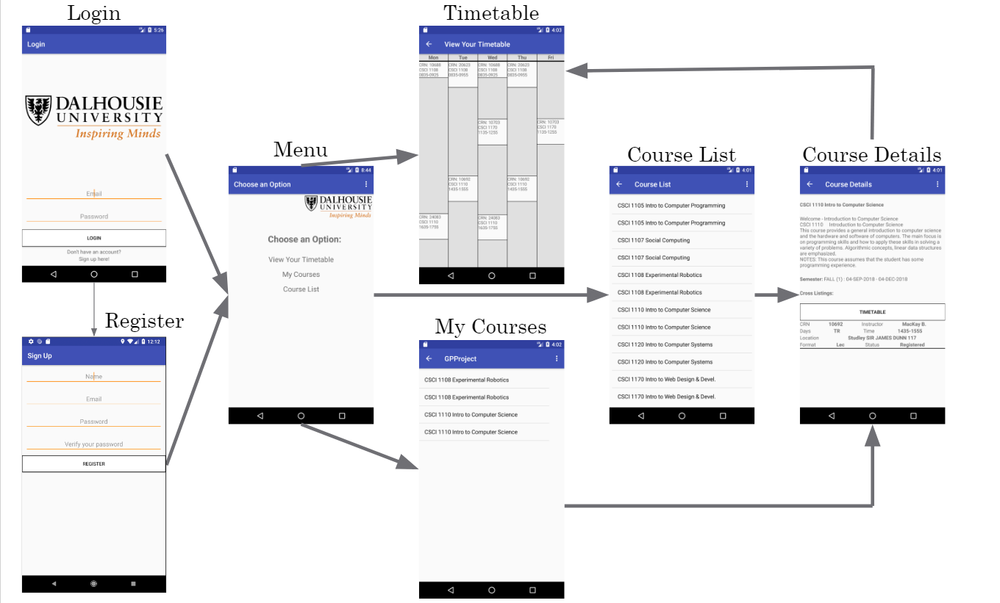
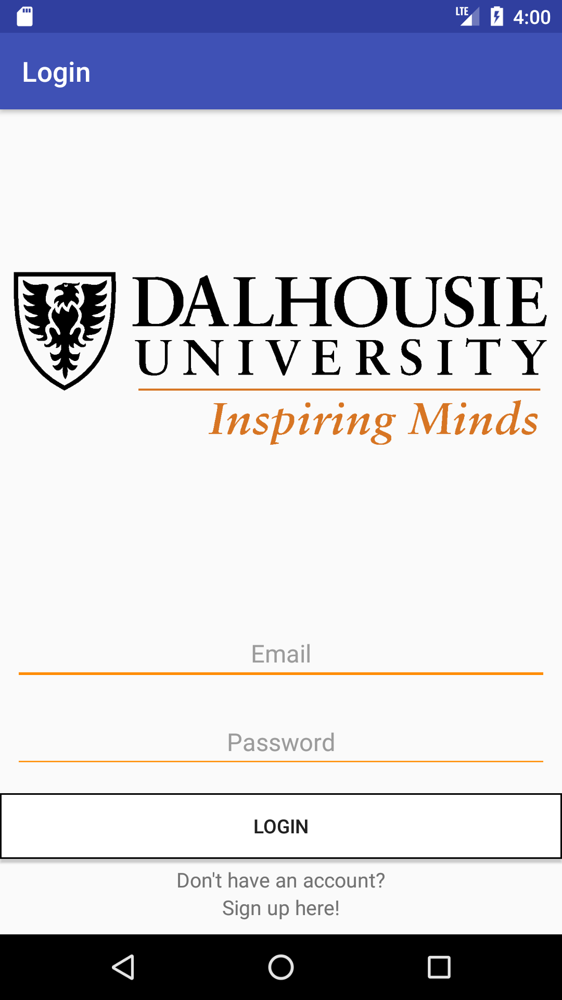
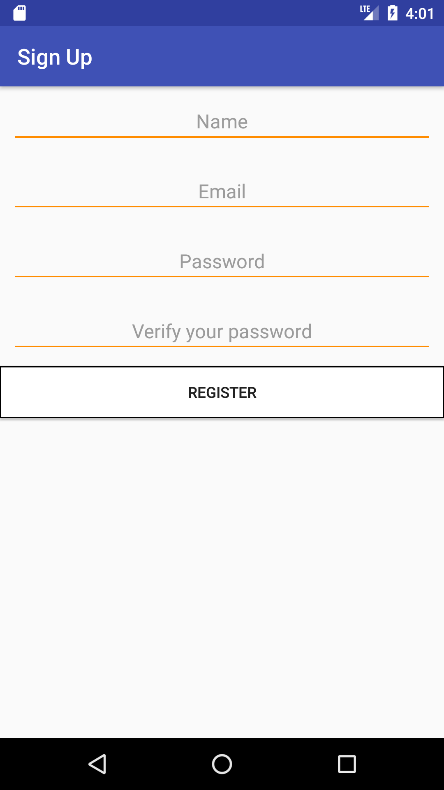
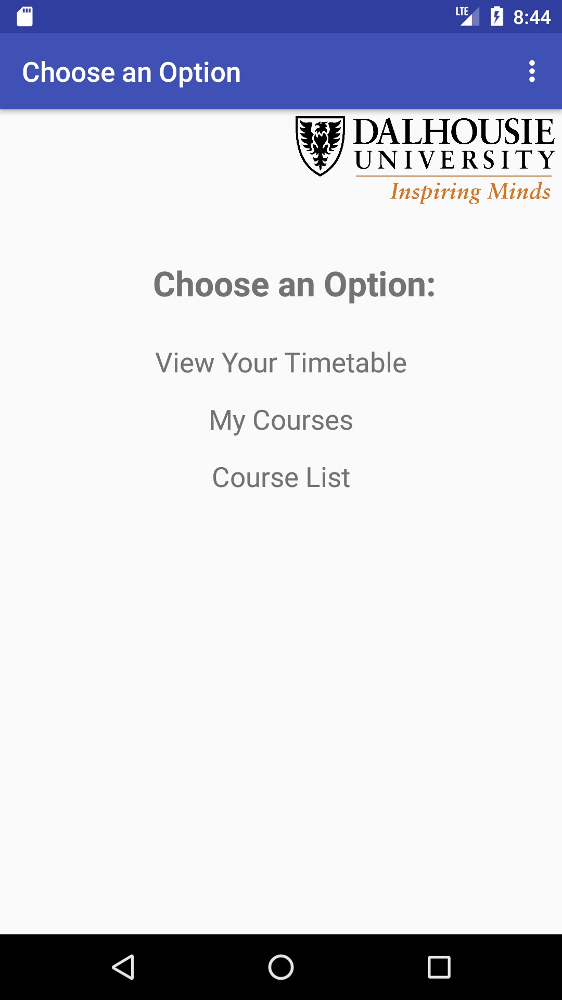
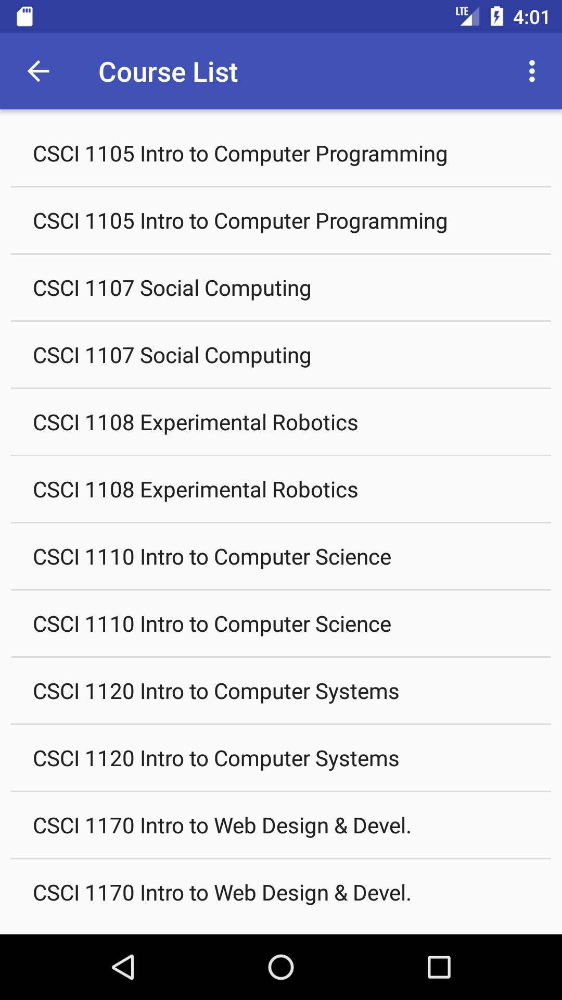
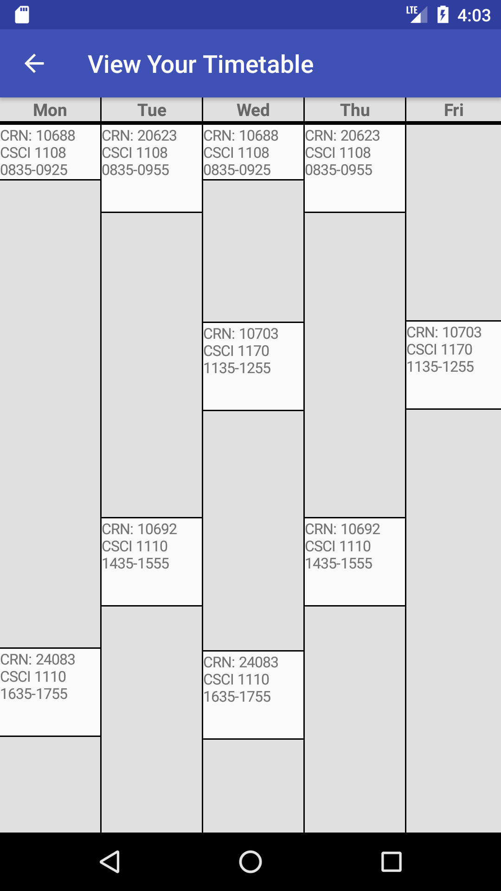
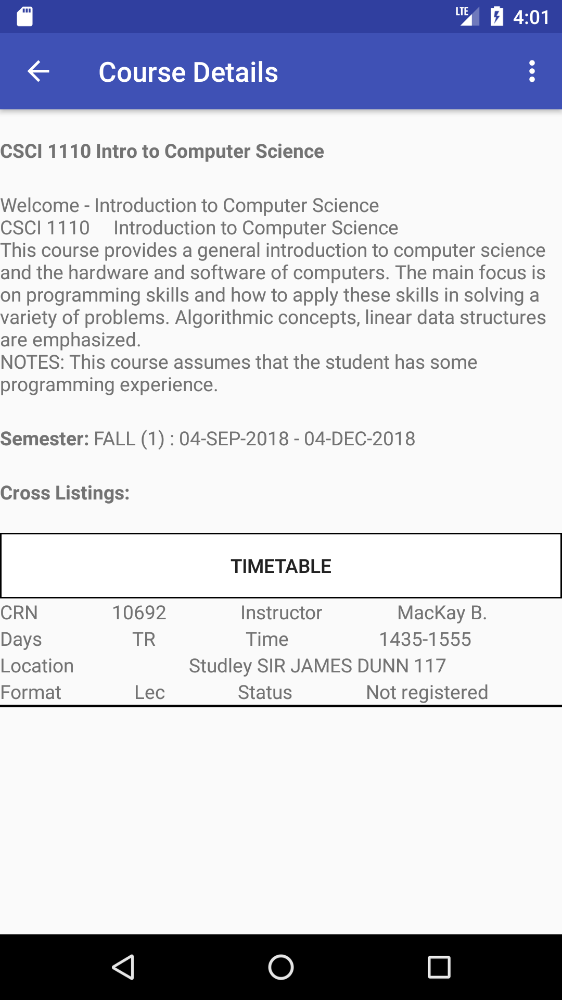

# SEGroupProject

* Marlee Donnelly 
* Matthew Reid 
* Nicholas Meade 
* Andrey Almabekov 
* Andrea Christians 
* Niamh MacMaster 
* Jake Moore 
* Simon Walker 

<b>Project details:</b> 
A mobile application that allows users to sign-up, register and drop courses at Dalhousie University. Additionally the application offers a timetable feature and checks for time/course conflicts. The project used Agile techniques such as pair programming, stand-up, and CI.
<h3> Structure </h3>
An outline of the application can be seen below (Fig. 1). 

    
   <b>Figure 1:</b> Basic structure of the application.

<h3> Project Details </h3>
<b>Framework:</b>  Android Studio   

<b>Continuous Integration:</b> Circle-CI 

<h3> Screenshots:</h3>

<figure>
   
    
   <figcaption> <b>Figure 2:</b> Login (left) and registration page (right).</figcaption>  
</figure>

  

<figure>
   
    
<figcaption> <b>Figure 3:</b> Menu (left) and course listings page (right).</figcaption> 
</figure>

  

<figure>
   
    
<figcaption> <b>Figure 4:</b> Course timetable (left) and course details page (right).</figcaption> 
</figure>

